Intro
=====

Domain: Sport, Gambling, High-Load

Short notice: all the numbers below might differ from reality, as I
remember, that it's still a test, so the analysis was short.

Short Description
=================

The system that is going to be developed, should work with multiple
sources, that own sports activities, parses them or retrieves the
information from them on a scheduled basis. The data, from the system,
should be parsed and stored, for further user access via REST API. The
sources are being queried on a scheduled basis (e.g., every 10
minutes/hour/day) for an upcoming match and every second for a living
match, in order to show to the end users, the most up-to-date info.

Requirements:
=============

Each game in the list should contain the following fields:

> • Date and Time
>
> • Sport Type
>
> • Competition's Name
>
> • Team Names

The system needs to store the games and identify a unique game and avoid
duplications

The unique identification of a game should be using the sport,
competition, teams

(regardless of their order) in a time frame of 2 hours

The list of games should be exposed via an API for querying

Performance requirements:
-------------------------

• The system needs to be distributed

• It should be designed to support high scale (with potential of growth)
:

-   It should support high throughput of incoming messages and always be
    available to get more updates, even if it's currently busy handling
    them

-   The API need to support growing number of concurrent users

Sources:
--------

<http://www.livescores.com/>
============================

<https://superplacar.com.br/>
=============================

<https://futbolme.com/>
=======================

Initial Domain Analysis
=======================

1.  The amount of sources: 50 + (ballpark) and might grow.

2.  The amount of sources per one live match: at least 10, 10-20.

3.  The amount of events per 1 game: 2500 on average

4.  1 event every 2 seconds on avg.

5.  **30-50 types of events** per one game type (based on soccer and
    tennis)

6.  **12 types of sports** is supported at the moment, might be 2 times
    more with the development of the system.

7.  Types of Apis: expected both HTML parsing and API calls to sources.

8.  60-150 soccer games happen during the 2021 Jan a day

9.  Ballparking around 100 games per day for a sport type (might change
    after COVID or in High Season).

10. Around 50-80 games might be online simultaneously.

11. Around 1000 games a day should be handled, with a possibility to
    support more.

12. Some games need to be tracked, e.g. 180 days prior to it's start.

13. Checking interval for not-running game is 10 minutes.

14. 1 000 000 active users, a day.

15. Spikes up to 5 000 000 users simultaneously.

System:
=======

There are 2 types of applications here, that can and should scale
independently from each other.

1.  **Parsing Engine:** System, that loads, parses the data has a
    scheduled number of calls that should not depend on user's activity.
    It only depends on the number of matches per day in the system as
    well as on the amount of sources that are being handled by the
    system.

> So its growth relates to:

a.  Number of matches per day.

b.  Number of sources per a competition.

c.  Amount of handled Sport Types.

```{=html}
<!-- -->
```
2.  **API:** An API that provides users with the newest information
    regarding that matches.

> Its load is dependent on:

1.  The number of users (popularity and amount of sport's handled)

2.  Daily activity (which region prevails)

3.  Major Competitions, like Cups, Olympics and so on.

**Concluding:**

Two types of applications, that consequently depend on each other, but
scale independently, thus different technologies can be used to handle
the load.

Load:
=====

Estimated number of requests/events, handled by the system:

Parsing System Load:
--------------------

1.  \~ 80 000 000 calls to query the upcoming matches a month

2.  \~ 1 620,000,000 calls to running games a month

3.  100kb -- 10mb - memory footprint to parse 1 page, depending on the
    page.

API System Load:
----------------

1.  \~ 1 500,000,000 messages from Parsing System, after deduplication.

2.  30,000,000 active users a month

3.  3\* 10(9) of events per month - Let's say 1 user is interested in 1
    match, querying the site every 5 minutes, each event triggers 5
    another events (sockets, message bus, http calls, logs, etc.)

4.  The system must be resilient and fail tolerant, thus duplication of
    nodes is required.

5.  The system might be geo-redundant.

Problems we need to solve:
==========================

-   System, that should parse the data, should scale and deploy
    independently from API system that faces users.

-   Large volume of duplicates from daily parses of upcoming
    competitions.

-   Try to avoid GC collections, by making our application domain
    short-lived, as we are going to work with parsed data -- which are
    strings, that will live in Generation 2 or Large object Heap, thus
    will slow us down.

-   Make the system HA/Fault Tolerant and Resilient, as we can see
    spikes during some major competitions.

-   Try to process messages from Processing System independently on
    different apps, as they will scale in different numbers.

-   Simplicity, desire to use less code, and outsource some
    functionality to infrastructure: (deduplication, scheduling,
    balancing)

-   Api does not belong to us, multiple versions of schema possible.

High-level system diagram:
==========================

As we have to different types of systems, that scale differently, the
best option is to separate them not only logically, but also physically.
We will gain in the amount of time, spent on the development -- as 2
independent systems, can be developed in parallel, without any common
setup phase, but also in the amount of money saved.

[Chart](https://lucid.app/lucidchart/invitations/accept/d9000bcf-87eb-41f0-a441-1acc3f55b9bf)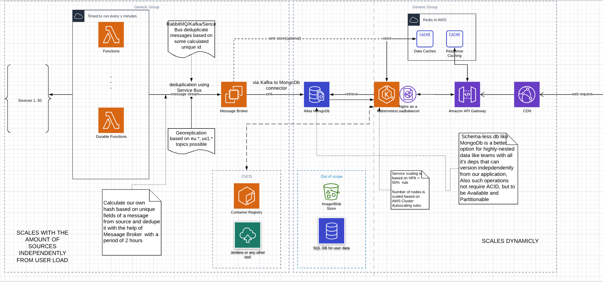{width="6.260416666666667in"
height="2.9345702099737534in"}

1.  **Functions** -- any type of highly-scalable FAAS solutions, e.g.,
    Azure Functions in this case.

    -   Possibility to develop locally

    -   Ideal for streaming of large volumes of data from multiple
        sources.

    -   Highly scalable, fault tolerant

    -   Ability to schedule many jobs, without using Schedulers.

    -   There is no need in **string.Intern()** and other optimizations
        related to LOH (Large Object Heap), when working with strings,
        that \> 85kb, due to the short-live.

    -   Native support of RabbitMQ/Kafka/Service Bus brokers.

    -   Ability to host and to use them in your own cluster if required
        -- KEDA Initiative, e.g. during architecture evolution.

    -   1 function might call all the sources, if required.

> 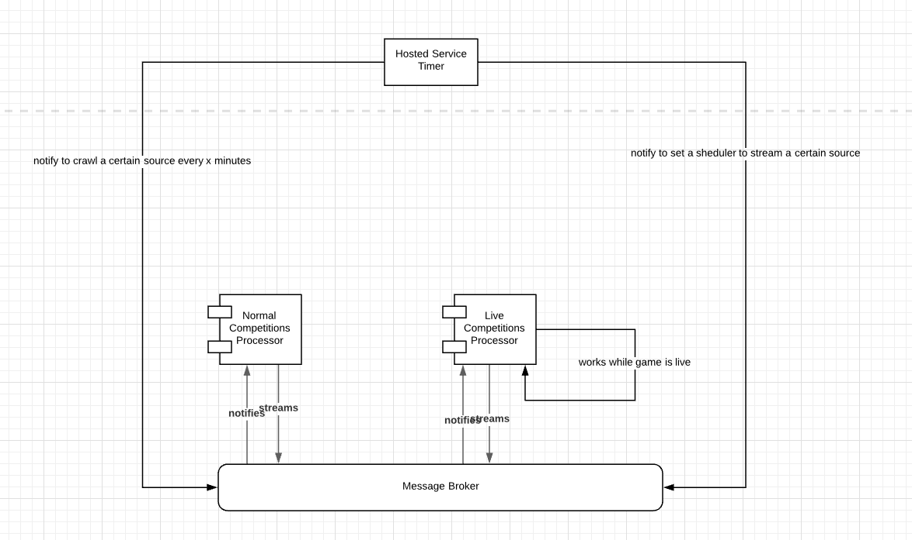{width="5.0in" height="2.96875in"}

2.  **Message Broker: Service Bus** (RabbitMQ/Kafka has this kind of
    functionality, while Amazon MQ lacks) -- Message Broker here is used
    to stream messages asynchronously to its processors, that might
    schedule independently from Functions. As during this phase, we will
    parse and retrieve enormous amount of duplicates (same event, same
    event from another source), Broker will serve here not only to
    balance the load, but also to de-duplicate. (1.
    <https://docs.microsoft.com/en-us/azure/service-bus-messaging/duplicate-detection>, 2.
    <https://github.com/noxdafox/rabbitmq-message-deduplication> ).

This is important as **all not-live data expected to be duplicates**,
while only some live-data might be them. This mechanism can be extended
and implemented manually, and will be described later. In this case, we
can store MessageId up to 7 days out of the box.

3.  **Database: Mongo DB,** hosted in Atlas. DAAS are easier to use and
    maintain, when we have relatively small teams.

Here we have several factors to choose NoSQL over SQL:

1.  We are not the owners of the source data, thus they might change,
    inflicting changes on our side.

2.  Requirement to replicate database under load -- it is far cheaper on
    NoSQL DBs, as they are AP/CP type.

3.  We have different almost same data, while they might have minor
    differences in the structure. In that case best suitable is
    document-oriented types, as we might not change the schema, while
    adding multiple newly supported types of sports and events, or we
    can version them quite easily.

> **Alternative:** Another option here would be to use **RavenDB:**

1.  Same benefits as MongoDB, but natively supports C\# - linq as a
    default query language would cost less on development time.

2.  If we are going to save 1 competition not as a document, but as a
    set of events (which it might be), it's the better option over
    MongoDb, as it's natively supports Event Sourcing. - match is a
    series of events.

3.  DDD compatible.

```{=html}
<!-- -->
```
4.  **Kubernetes cluster. -** is used to host APIs, actually, pretty the
    same as a set of owned VMs, but has an ability to
    replicate/duplicate/handle failures out of the box. As well as an
    ability scale VMs or pods (services) under load automatically, using
    HPA and Cloud Apis. Pricing is the same as for VM Scale Group, but
    required additional configuration.

5.  **Nginx** -- known Load Balancer, the simplest solution here, can
    serve as a Reverse Proxy, might be replaced with Azure API
    Management/Kong/Tyk or any other engine. Will load balance the load
    between hosted API services, if Service Mesh is not used. Can be
    replaced by Istio as well later on.

6.  **CDN, Redis Caches, Gateways** might be used if required to deliver
    the functionality faster to the end user.

Pricing Considerations:
=======================

Functions:
----------

Bases on preliminary analysis, calculated for Azure Cloud, the initial
assumptions are as follows:

Memory consumption: **128-256 MB** per function app.

Normal Competitions
-------------------

Running time per call: call to the source around 200ms-300ms, processing
and parsing around 200ms, pushing to the queue depends on the amount of
messages, about 300 **ms in avg**.

3 sources per 1 upcoming match.

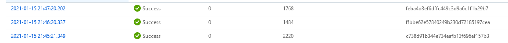{width="6.26875in"
height="0.5409722222222222in"}

Number of calls to analyze upcoming competitions: \~80 000 000

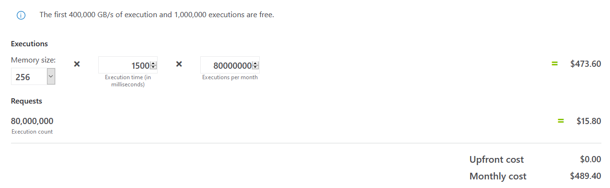{width="6.26875in"
height="1.9402777777777778in"}

Live Competitions:
------------------

Number of Sources: 20

Number of Live competitions runs: 81 000 000

Number of Functions Involved 3

Average running time (40 ms + 210ms + 30ms) /3 : \~100ms

Total calls:

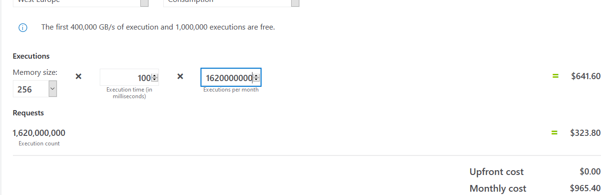{width="6.26875in" height="2.00625in"}

We can start from 7 nodes default configuration, that can scale up and
down dynamically, depending on the load.

Cluster:
--------

Minimally we need (approximated):

3 nodes -- to support Production environment when not under load.

2 nodes -- to support QA/Staging environments.

1 node -- to handle Istio, Pilot and other Service Mesh staff.

1 node -- Monitoring and Observability tools, like Grafana, and load
balancer.

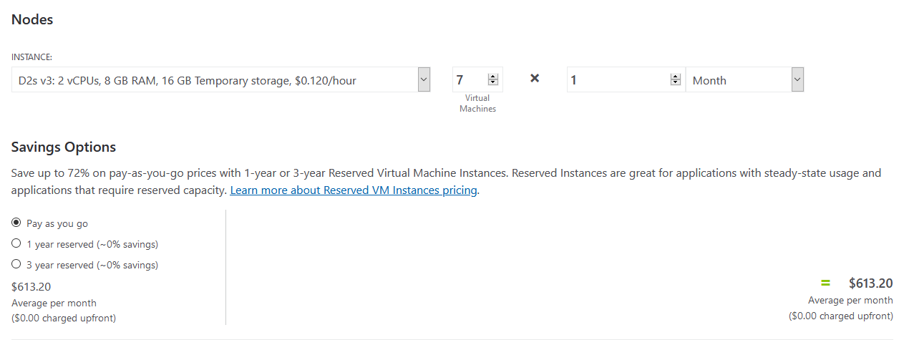{width="6.26875in"
height="2.357638888888889in"}

**Compute: \$1,168.20**

The Rest:
---------

MongoDb, CDN, DNS, KeyVault if required, Redis Cache, CI/CD, Container
Registry, Package Regeistry, Blob Storages, Service Bus, Logging and
Monitoring might be approximated as Total compute load / 2

QA Environment should be added as well in the pricing afterwards.

**\~3000 USD + QA + Operations Cost + CI/CD VMs =**

**Total: \~3500**

Parsing Engine:
===============

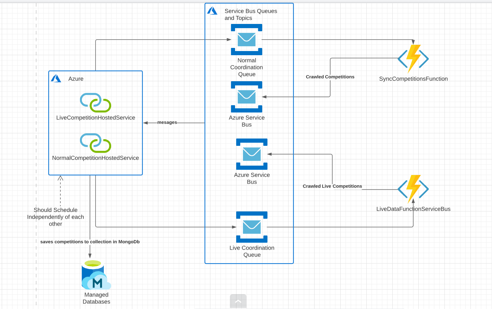{width="5.364583333333333in"
height="3.3640409011373578in"}

Currently, we have two models of behavior here:

1.  Matches in the future, that changes rarely, but should be observed
    on periodically, let us say every 10min, 1hour or day. These periods
    are different from those one that we need to have in the app that
    tracks live matches, so they scale differently and have different
    logical model.

Can be performed by a normal Serverless Function that can scale almost
indefinitely.

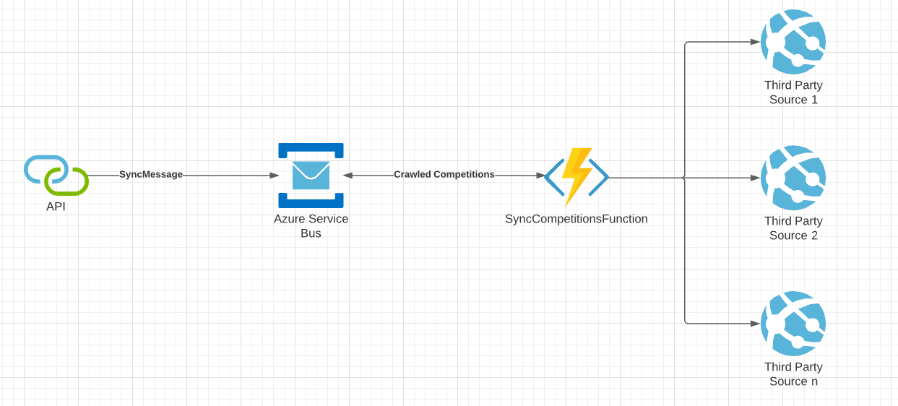{width="6.820278871391076in"
height="3.0833333333333335in"}

2.  Live matches, that are currently ongoing, should be observed every
    1-5 seconds with usage of multiple sources. Should be run by Durable
    function, that triggers, itself, after the signal to do the job was
    consumed from the broker. Should sleep while waiting. Can be
    triggered and put to sleep without any external scheduling.

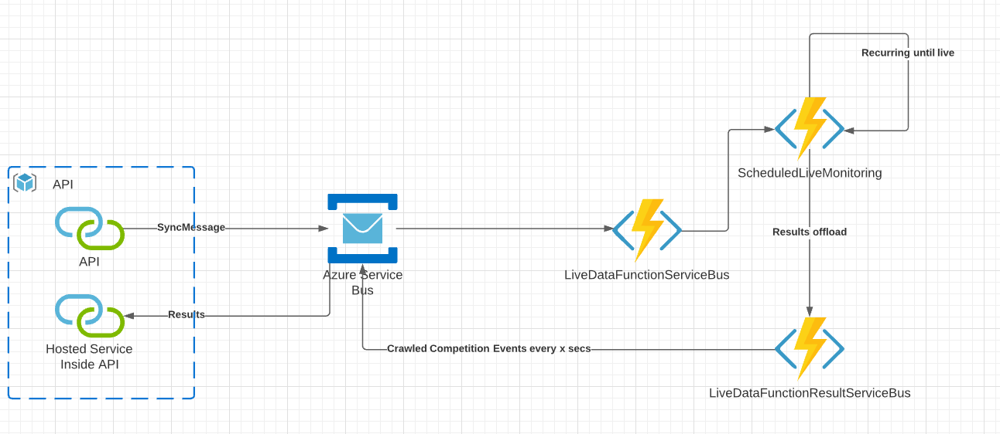{width="6.88995406824147in"
height="3.0in"}

API:
====

The application intended to be dockerized and hosted in a set of VMs or
Kubernetes cluster. Usage of Kubernetes at the moment if by far the most
easiest and common way to work with Highly Available and loaded systems.

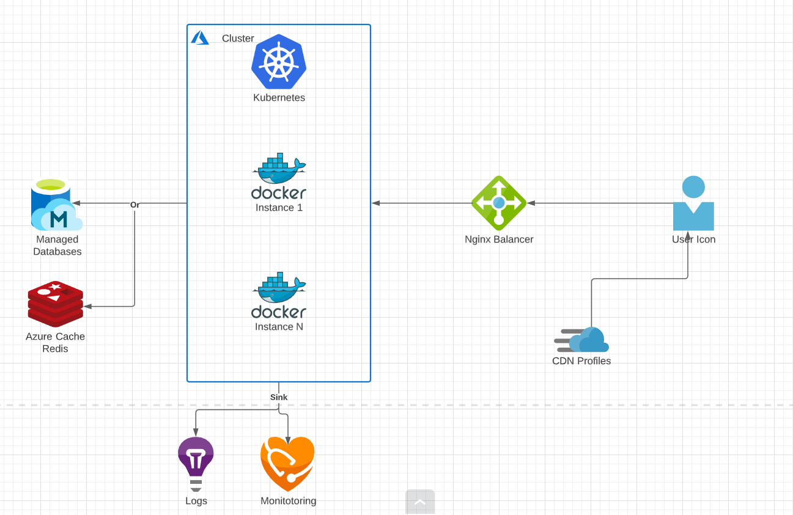{width="6.822247375328084in"
height="4.427083333333333in"}

**Scalability** -- obtained by HPA's from Kubernetes when we are
speaking about pod scaling, by Autoscaling group rules, when we need to
scale the amount of the VMs currently run.

**Reliability** -- obtained by usage of Readiness and Liveness health
checks in the application, that utilized by the Kubernetes.

**HA/Fault Tolerance** -- configuration of the kubernetes Deployment in
order to be durable, thus to have replication of the application in
different nodes, or even regions, availability also includes an external
Gateway/Reverse Proxy, that will balance the load between the pods in
K8s.

At the moment, the API should be logically split into 3 applications:

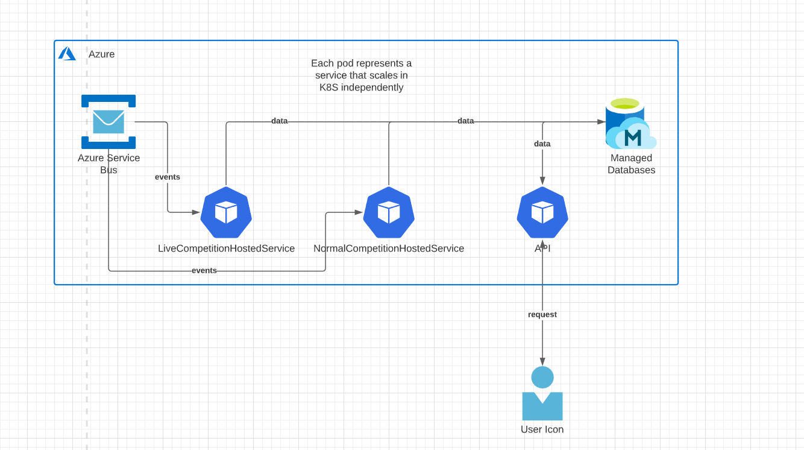{width="6.828358486439195in"
height="3.8125in"}

1.  LiveCompetitionHostedService -- there would be around 80kk of the
    messages, so this should be placed in a separate pod.

2.  NormalCompetitionHostedService -- this hosted service won't be
    handle lot's of messages, normally can be placed together with the
    API.

3.  API -- the api itself, should spike when under user load.

All the applications should communicate with 1 database, as logically
they are 1 microservice, even that physically are split and
containerized separately.

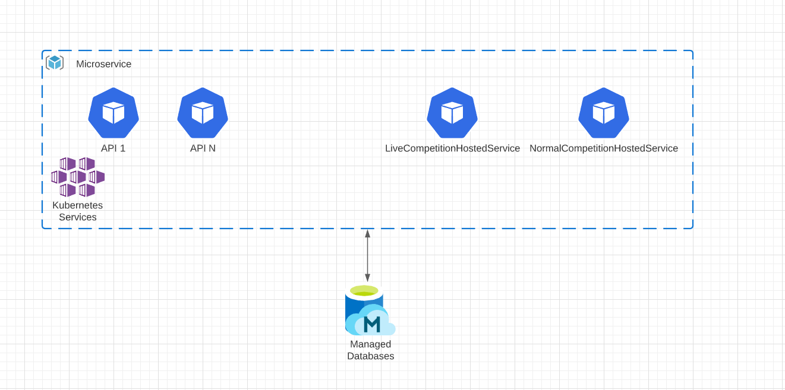{width="5.9913713910761155in"
height="2.982638888888889in"}

Development Spec:
=================

Requirements:

-   Docker: <https://www.docker.com/products/docker-desktop>

-   .NET Core SDK 3.1.403 (exactly):
    <https://dotnet.microsoft.com/download/dotnet-core/3.1>

-   Visual Studio 2019 installed.

-   Azure Functions SDK installed.

-   Vs Code Installed.

-   Git Installed.

-   CI/CD: Azure Pipelines.

-   Everything is setup in Azure for simplicity of a task: Requires
    Access.

Processing:
-----------

Both Processing functions can be triggered by a message from Broker,
that owns basic information regarding what has to be triggered and
where:

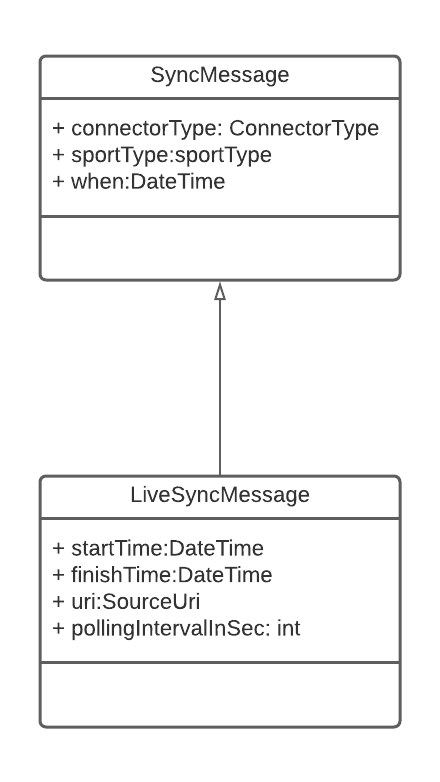{width="2.1458333333333335in"
height="3.8169827209098863in"}

Both functions can utilize the same logic, abstracts of which can be
shared via Nuget package. As the apps are relatively small, it's
possible not to split the logic at the moment, for the simplicity of
development and refactor it later, when the abstractions will lay down.

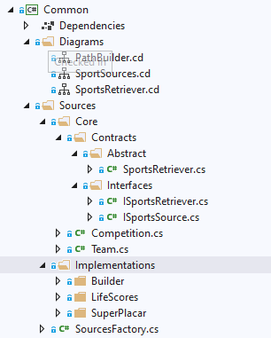{width="3.1879451006124233in"
height="3.969304461942257in"}

1\. Each source, which information should be retrieved should have it's
own SportsRetriever. Here we have 2 implemented for LifeScores and
SuperPlacar.

2\. Each Retriever can have a set of sports, that it only knows, how to
retrieve and process -- as one html (or API) parsing logic can be
different from another one.

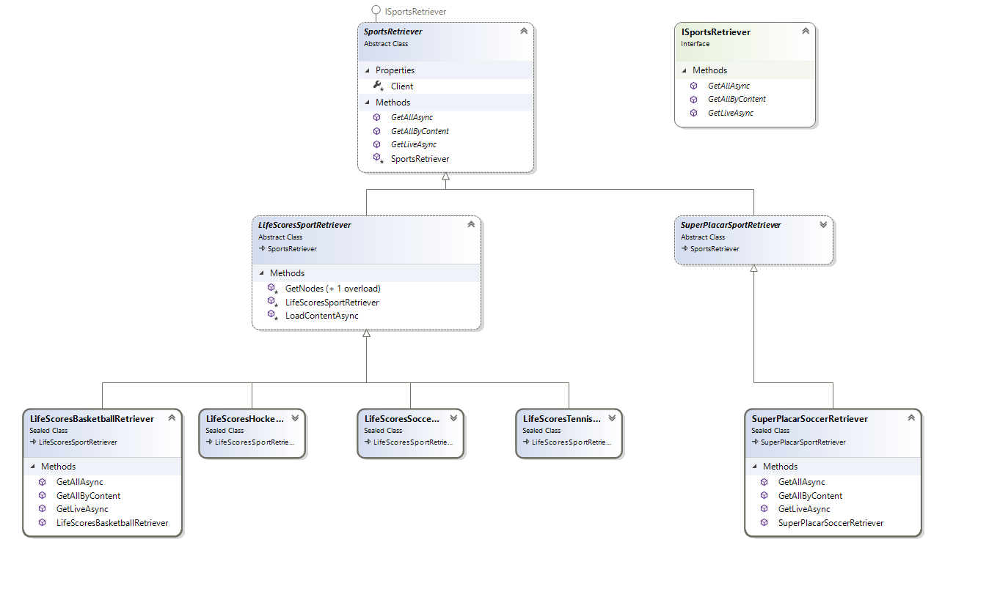{width="7.428794838145232in"
height="4.4375in"}

As every sport and retriever implements its own logic of parsing, we
need to implement a way to encapsulate Path Building behavior into the
retriever.

As one sport usually occupies different page on a different url.

IPathBuilder -- path builder interface that implements only 2 methods, 2
build Concrete object of Retriever in dependence of the sport specified.
Diagram can be viewed below.

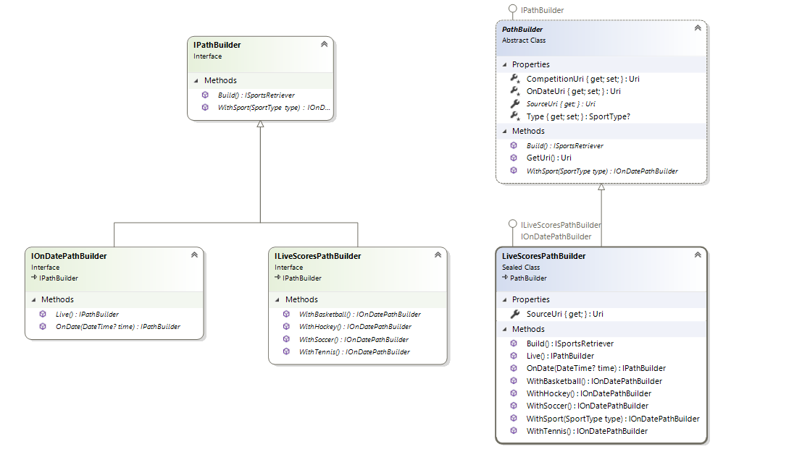{width="7.5570330271216095in"
height="4.3144050743657045in"}

SourceFactory should be injected in Functions ctor and create the
source, based on a message from the broker:

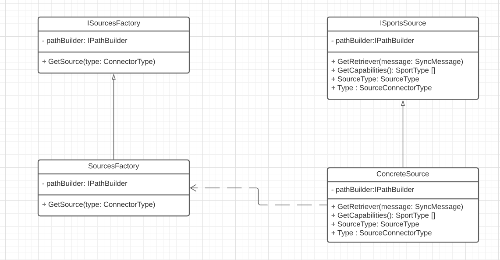{width="6.26875in" height="3.26875in"}

The basic project structure and and example can be found in the POC.

While Normal Competition processing is pretty obvious and is a simple
message -- result pattern, the live app function requires additional
details to be described.

Live Function Sequence Diagram describes the behavior of the function
app itself:

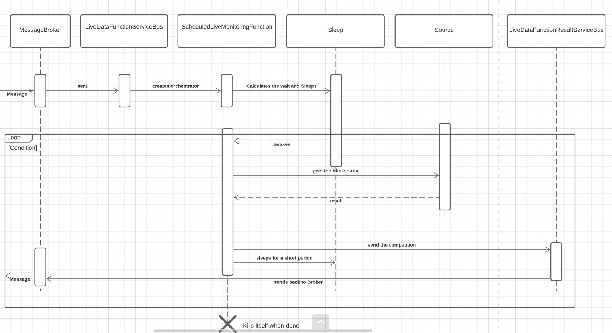{width="6.26875in"
height="3.4138888888888888in"}

[Source](https://lucid.app/lucidchart/invitations/accept/2d28f1d0-6485-42d2-9578-152f78997db6)

Deduplication:

Currently, we have large volumes of messages from both Normal and Live
Processing functions. Each of which might and will send duplicates. We
can reduce the amount of them taken by Hosted Services by adding a
hashing function to our messages. So, if we believe that Uniqueness is a
matter of those fields of **Competition** object: Teams, SportType, Time
and Name.

We can implement a solution to obtain some kind of uniqueness, below is
a naïve implementation that has to be changed prior usage in production:

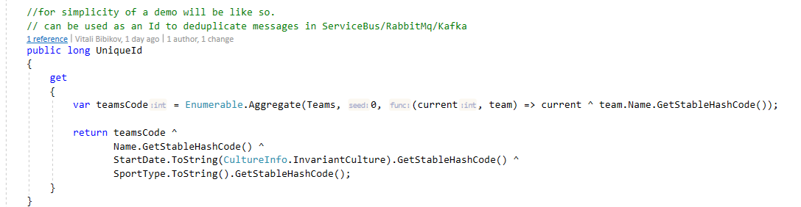{width="6.865646325459317in"
height="1.78125in"}

API:
====

Project structure:
------------------

Should be organized with accordance to [Clean
Architecture](https://docs.microsoft.com/en-us/dotnet/architecture/modern-web-apps-azure/common-web-application-architectures#clean-architecture):

So, the basic structure have to be as follows:

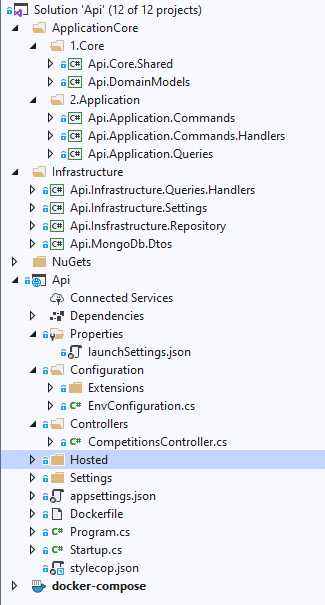{width="3.3858891076115487in"
height="6.3029625984251965in"}

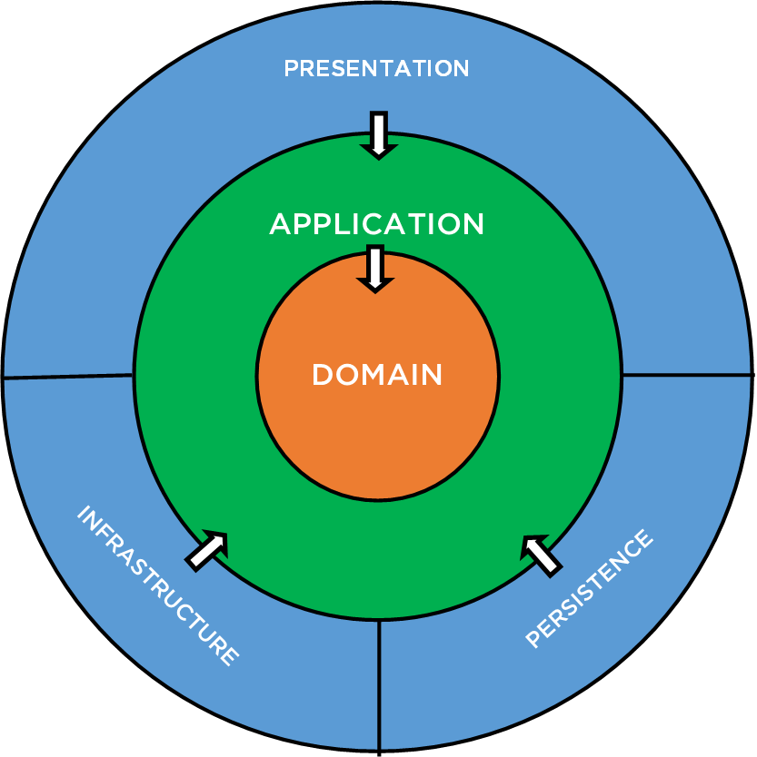{width="3.3230938320209975in"
height="3.3270833333333334in"}

Also, there is no any sense to support CQRS from the start, but the
structure of the app will separate Reads (via Queries) and Writes (via
Commands and Repositories), in order to have an ability to migrate later
to a different write/read databases.

1.  Api.Core.Shared-- an owner of all the ErrorCodes in Domain/Core,
    > Basic Enums and Domain Exceptions.

2.  Api.DomainModels -- all the domain logic is placed here. Something
    > later might be placed in a Api.Domain.Services assembly. Also,
    > here belongs all the interfaces (ports) to obtain data
    > --Repositories.

3.  Domain Models should guard it's logic via incapsulating fields, thus
    > removing parameterless constructor and all the setters.

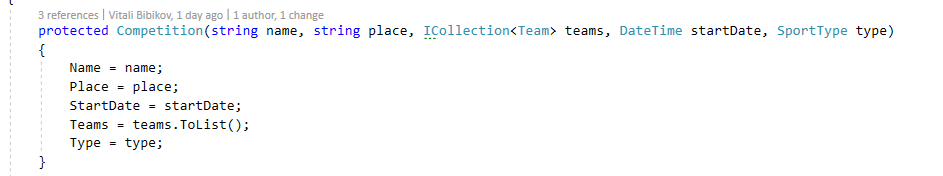{width="6.26875in"
height="1.1701388888888888in"}

4.  Api.Application.Commands, Api.Application.Queries own the Commands
    > and Queries respectively.

5.  Api.Application.Commands.Handlers -- belongs to Application Layer,
    > as it Command.Handlers should not reference Infrastructure
    > directly, but inject an Interface (ISpecificRepository)

6.  Api.Insfrastructure.Repository -- implements data access logic.

7.  Api.MongoDb.Dtos -- stores basic dtos, which we should use to store
    > the data in the db. Should be mapped directly from DomainModels.

8.  Api -- all the UI Adapters (Controllers), Configurations, Startup
    > logic, HealthChecks should be here.

Nuget Sharing:
==============

Some deps can be shared between hosted services, Api and Azure
functions, and thus has to be versioned and placed in a common Nuget
Server.

This server can be deployed as a Free Tier Application in Azure or as a
part of CI/CD (if provided).

Below is a basic structure, offered to be shared via packages, 1 foder
-- 1 package in order to follow CCP principle.

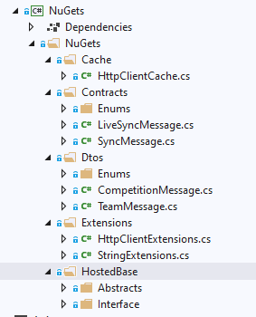{width="3.9080949256342956in"
height="4.833333333333333in"}

Hosted Services:
================

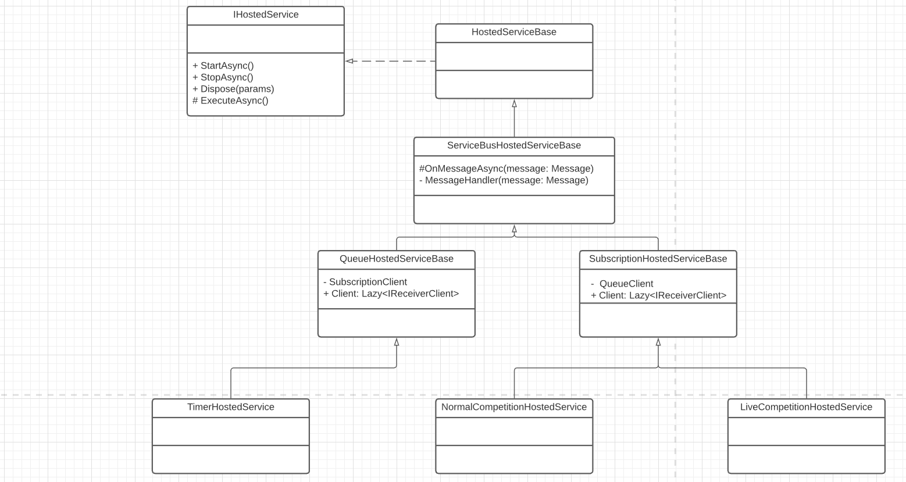{width="6.26875in"
height="3.3354166666666667in"}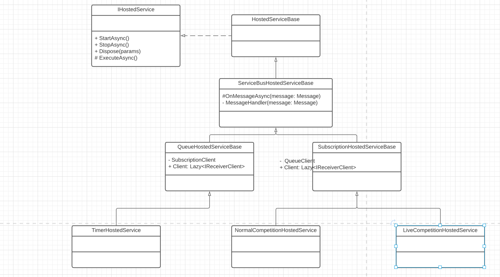{width="6.26875in"
height="3.4770833333333333in"}

[Source](https://lucid.app/lucidchart/invitations/accept/d4ea913a-9c2c-47f7-a05c-800242189d19)

We should have 3 types of processors/schedulers that are working with
our broker:

Output:

**TimerHostedService**: Schedules the events of when to process the
message and sends them via Message Broker to Processing Functions;

Input:

**NormalCompetitionHostedService**: Processes and stores events from a
normal message processor -- function app and persists them in the db.
Does not subjected to big volumes of messages, as they are de-duped when
sent via Service Bus, thus might be a part of API docker image.

**LiveCompetitionHostedService**: Processes and stores events from a
live message processor -- function app and persists them in the db.
Subjected to big volumes of messages, as the amount of duplicates should
be drastically lower, while the amount of messages is excessively big.
Should be originally placed as a separate app.

Dockerization:
==============

Application should be dockerized in order to be used in CI/CD, installed
by the QA team easily.

-   For the local development Docker-compose is offered, instead of
    minikube or any other alternatives to K8S to be used, as it is much
    lighter does not require any knowledge to be configured on a local
    machine.

-   Alpine Images should be used to dockerize the app, as they are
    lighter, thus faster to deploy, test and scale.

Below is the example of the image configuration, can be found in API
POC:

FROM mcr.microsoft.com/dotnet/core/aspnet:3.1-alpine3.12 AS base

WORKDIR /app

RUN echo -e
\"http://nl.alpinelinux.org/alpine/v3.12/main\\nhttp://nl.alpinelinux.org/alpine/v3.12/community\\nhttp://nl.alpinelinux.org/alpine/edge/testing\"
\> /etc/apk/repositories

RUN apk update && apk add libgdiplus && apk \--update add \--no-cache
icu-libs

ENV DOTNET_SYSTEM_GLOBALIZATION_INVARIANT=false

FROM mcr.microsoft.com/dotnet/core/sdk:3.1-alpine3.12 AS builder

LABEL stage=\"intermediate\"

WORKDIR /src

COPY . .

WORKDIR \"/src/Api\"

FROM builder AS publish

RUN dotnet publish \"Api.csproj\" -c Release -o /app

FROM base AS final

WORKDIR /app

COPY \--from=publish /app .

LABEL project=\"test\"

ENTRYPOINT \[\"dotnet\", \"Api.dll\"\]

Intermediate container must be used in order to have minimal runnable
image in runtime.
